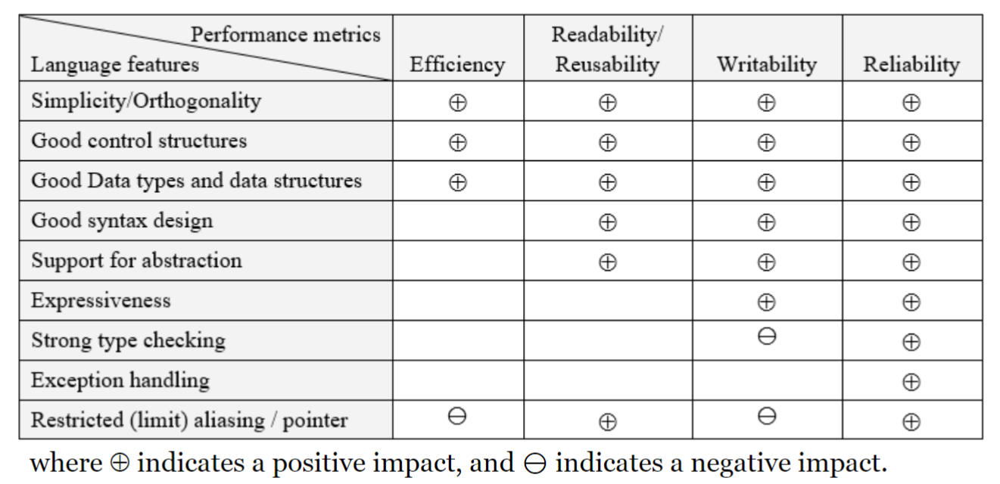

## 評估編程語言的指標 00:52
指標通常是相對的, 個指標的重要性取決於專案場合
1. 可靠性: 可靠的語言多會限制人能做的事, 例如Java相較於C
2. 可讀性
3. 可寫性
4. 可複用性
5. 效率

## 語言特性對於指標的影響 04:28 (pic)

1. 指標並非絕對, 但大致來說如此
2. 強類型檢查: 會限制可寫性, 但寫出來的程式更可靠
3. 限制指針: 會降低效率, 限制可寫性, 但更可讀,可靠 

## 語言發展影響因素 11:08
1. 早期受限於硬件發展, 語言強調效率
2. 編譯器技術
3. 編寫大型程式的需求
    1. 70s軟件危機, 程式越來越複雜, 發現錯誤難卻以修復
    2. 代碼, 組件, 系統重用
    3. 重用的可信度
    4. 網路共享

## 語言發展里程碑 16:22
1. 40s存儲程序概念: 儲存一系列指令並順序執行, 成為程序, 底層為二進制(稱為機器碼)
2. 助記符號(彙編語言): 
    1. 以一些符號取代二進制指令, 例如
        1. 簡單的變量
        2. 條件式
        3. 尋址
    2. 有助於編寫更複雜的程序
    3. 執行時需轉換成機器碼才能執行
3. 高級語言:
    1. 第一款高級語言: 1952年, Autocode
        1. 用單字母標示符: a, b, c...
        2. 可以簡單的計算式 a+b-c*d...
        3. 僅限於研究, 並沒有大規模使用
    2. 第一個流行的高級語言: FORTRAN
        1. 不同類型的變數: 實數, 整數
        2. 規程
        3. 條件 if-then, no if-then-else
        4. 簡單的結構控制, 例如以大小來切分程式碼
        5. 仍較低階, 仍對特定機器的依賴程度高, 仍需要了解硬件來使用
        6. 較複雜的程式會變成Spaghetti code麵條式代碼, 雜亂難以理解
        7. 仍持續在更新
    3. 70s結構化編程(第一代software engineer): Algol, Pascal, C
        1. 更抽象的語言, 使人更好理解
        2. 注重程序架構:
            1. 對子程序有更好的支持
            2. 為了方便重用
            3. 更好的數據結構
            4. 更好的控制
        3. 鼓勵局部變數
        4. 開始減少使用`GOTO`
            1. `GOTO`用來跳轉到特定行數的程式碼
            2. 早期`GOTO`多沒有限制, 程式會碼到處跳轉, 使得可讀性極低, 難以除錯
            3. 現今多以有限制的跳轉來取代, 例如`break`,`continue`
    4. OOP面相對象程序設計(第二代software engineer)
        1. 強調抽象, 封裝的概念, 使得程序可以更好的分割, 不同的人可以負責不同部件
        2. 更加支持代碼重用, 繼承
        3. 現今主流語言多支持OO
    5. 並行和分部式計算
        1. 並行, 多線程
        2. 多處理器
    6. 面相服務程序設計(第三代software engineer)
        1. 基於OO和web結合

## 計算語言范式 34:27 40:41
描述語言如何表達的基本原則
1. 命令式: 一步一步執行, 需全部定義清楚, 幾乎式所有語言的基礎
2. 面相對象: 將程序封裝成對象, 透過訪問對象來編程
    1. 封裝程抽象的對象
    2. 包含繼承, 多型
    3. 動態/ 延遲綁定
3. 函數式: 更加抽象, 更接近數學, 強調引用透明(沒有副作用)
    1. 沒有變數, 沒有狀態, 所以也沒有副作用
    2. 強制模塊化設計
4. 邏輯/聲明式: 定義對象的事實, 規則, 關係, 目標式只需定義不須步驟
    1. 數據庫
    2. 關係, 查詢, 匹配, 推理
5. 面相服務: 根據服務計算三方模型
6. 多線程: 並行處理, 同步, 資源共享
6. 現代語言多都支持多種范式
